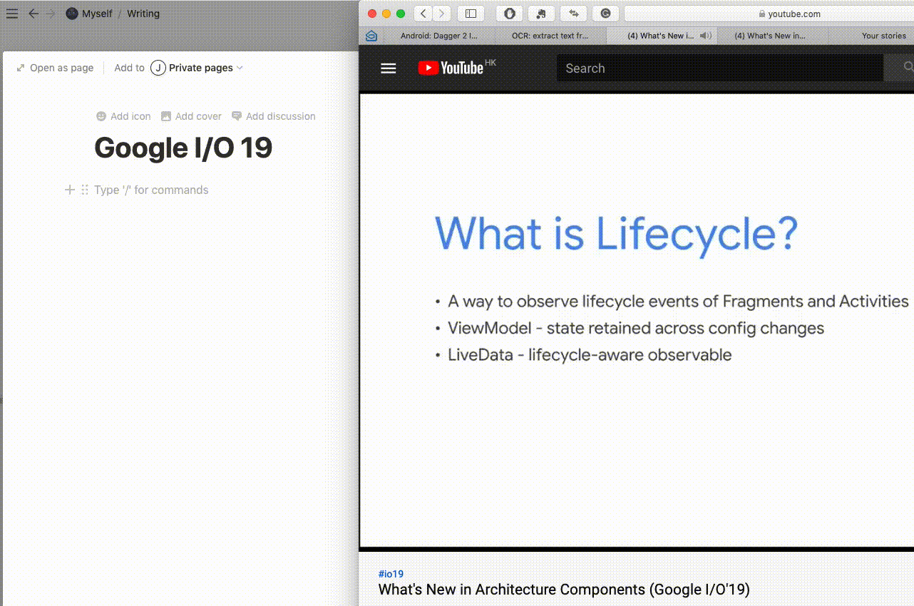
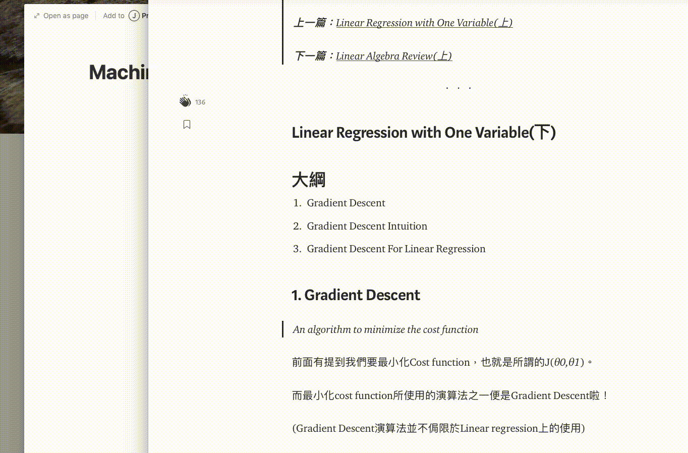

# Alfred Workflow OCR

## ** A slightly modified version from nicooprat's [project](https://github.com/nicooprat/alfred-ocr) **
For some reason that project is not updated anymore so I made a new one based on it.

## Usage

Read the [Full tutorial](https://medium.com/@johnny0116/ultimate-online-courses-note-taking-with-notion-and-alfred-4c9e473e6ba0) here.

Type `ocr` in Alfred -> take a screenshot -> wait for the notification -> paste the text!!


You can use it to recognise any languages.



Even with multiple languages (traditional Chinese + English here). Download the [multi lang workflow](https://github.com/johnnyhoichuen/alfred-ocr/blob/master/OCR%20multi%20lang.alfredworkflow)


For changing the default languages, please read my [Medium article](https://medium.com/@johnny0116/ultimate-online-courses-note-taking-with-notion-and-alfred-4c9e473e6ba0).

You can also add a language as optionnal argument like this: `ocr fra` ([full list of language codes here](https://github.com/tesseract-ocr/tesseract/blob/b67ea2c1a70c56053e142a5fb7cc18fb29cdc4b8/src/training/language-specific.sh#L21)).

## Installation

1. [Install `tesseract` on your system](https://github.com/tesseract-ocr/tesseract/wiki#macos): 
   
   a. Install Homebrew if you haven't
   
   b. Then `brew install tesseract`(if you need English only) or `brew install tesseract-lang`(if you need additional     langugages.)
   
2. Download the [workflow](https://github.com/johnnyhoichuen/alfred-ocr/blob/master/OCR%20multi%20lang.alfredworkflow)
3. Double click to install it in Alfred

## If you need multiple languages

5 lines of code:

```bash
export PATH=/usr/local/bin/:$PATH 
screencapture -i /tmp/ocr_snapshot.png

if [{query} = ""]; then 
  tesseract /tmp/ocr_snapshot.png stdout -l chi_tra+eng 2>&1 //////// replace (chi_tra+eng) for your default language(s) here!! 
else 
  tesseract /tmp/ocr_snapshot.png stdout -l {query} 2>&1 
fi
```

## Discussion

On Alfred forum: https://www.alfredforum.com/topic/12006-ocr-extract-text-from-snapshot/


## Credits

Based on [project](https://github.com/nicooprat/alfred-ocr) by nicooprat
