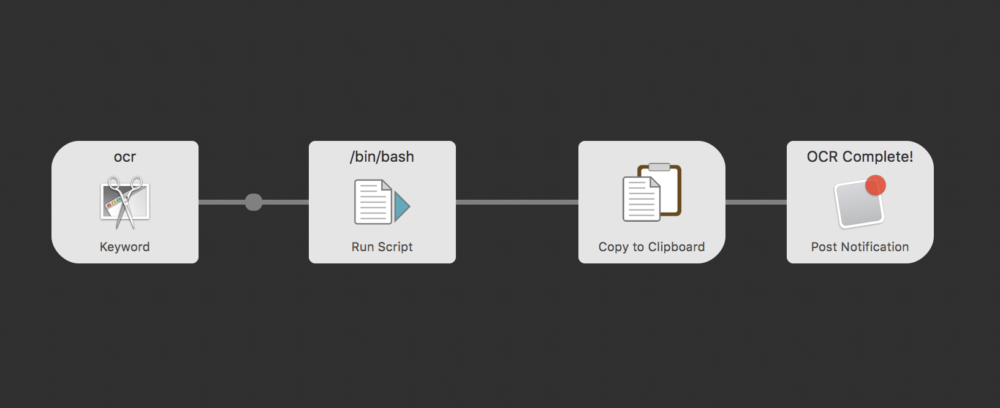

# Alfred Workflow OCR

## ** A slightly modified version from nicooprat's [project](https://github.com/nicooprat/alfred-ocr) **
For some reason that project is not updated anymore so I made a new one based on it.

## 
Take a snapshot and recognize text

[](./alfred-ocr.png)

## Installation

1. [Install `tesseract` on your system](https://github.com/tesseract-ocr/tesseract/wiki#macos): `sudo port install tesseract` or `brew install tesseract` and then `brew install tesseract-lang` if you need additional langugages.
2. Download the [workflow](https://github.com/nicooprat/alfred-ocr/blob/master/OCR.alfredworkflow)
3. Double click to install it in Alfred

## Usage

[]

[]

Use the keywork `OCR`, take a screenshot, wait for the notification, paste the text. For better results, you can also add a language as optionnal argument like this: `OCR fra` ([full list of language codes here](https://github.com/tesseract-ocr/tesseract/blob/b67ea2c1a70c56053e142a5fb7cc18fb29cdc4b8/src/training/language-specific.sh#L21)).

[](https://postimg.cc/5jRSjcqQ)

## What's inside?

5 lines of code:

```bash
export PATH=/usr/local/bin/:$PATH 
screencapture -i /tmp/ocr_snapshot.png

if [{query} = ""]; then 
  tesseract /tmp/ocr_snapshot.png stdout -l chi_tra+eng 2>&1 
else 
  tesseract /tmp/ocr_snapshot.png stdout -l {query} 2>&1 
fi
```

## Discussion

On Alfred forum: https://www.alfredforum.com/topic/12006-ocr-extract-text-from-snapshot/


## Credits

Based on [project](https://github.com/nicooprat/alfred-ocr) by nicooprat
